<div align="center">

# AIos

### Open-Source AI Agent Management & Orchestration Platform

Build, deploy, and orchestrate AI agents, multi-agent teams, and automated workflows — all from one unified control plane. Supports OpenAI, Anthropic, Google Gemini, Ollama, OpenRouter, and any OpenAI-compatible endpoint.

[](LICENSE)
[](https://github.com/sup3rus3r/aios/stargazers)
[](https://github.com/sup3rus3r/aios/network/members)
[](https://github.com/sup3rus3r/aios/issues)
[](https://github.com/sup3rus3r/aios/pulls)
[](https://www.python.org/)
[](https://nextjs.org/)
[](https://fastapi.tiangolo.com/)
[](https://react.dev/)
[](https://tailwindcss.com/)
[](https://www.sqlite.org/)
[](https://www.mongodb.com/)

---

**If you find this project useful, please consider giving it a star!** It helps others discover the project and motivates continued development.

[**Give it a Star**](https://github.com/sup3rus3r/aios) &#11088;

---


*AIos — Dashboard overview with agent, team, and workflow management*

</div>

---

## Table of Contents

- [Why AIos?](#why-aios)
- [Features](#features)
  - [Multi-Provider LLM Support](#multi-provider-llm-support)
  - [Agent Builder](#agent-builder)
  - [Multi-Agent Teams](#multi-agent-teams)
  - [Workflow Automation](#workflow-automation)
  - [Real-Time Chat Playground](#real-time-chat-playground)
  - [Tool Integration](#tool-integration)
  - [MCP Protocol Support](#mcp-protocol-support)
  - [Secrets Vault](#secrets-vault)
  - [Session History](#session-history)
  - [Security & Authentication](#security--authentication)
  - [Admin Panel & RBAC](#admin-panel--rbac)
  - [RAG & File Attachments](#rag--file-attachments)
  - [Dual Database Support](#dual-database-support)
- [Screenshots](#screenshots)
- [Architecture](#architecture)
- [Quick Start](#quick-start)
  - [Prerequisites](#prerequisites)
  - [Backend Setup](#backend-setup)
  - [Frontend Setup](#frontend-setup)
  - [Running Both Together](#running-both-together)
  - [Environment Variables](#environment-variables)
- [Usage Guide](#usage-guide)
- [API Reference](#api-reference)
- [Tech Stack](#tech-stack)
- [Project Structure](#project-structure)
- [Contributing](#contributing)
- [Citation](#citation)
- [License](#license)

---

## Why AIos?

Most AI agent frameworks are code-only libraries that require deep programming knowledge. **AIos** provides a complete visual interface for building, managing, and running AI agents — no SDK glue code required.

- **No vendor lock-in** — Swap between OpenAI, Anthropic, Google, Ollama, or any OpenAI-compatible provider without changing a single line of agent configuration.
- **Visual orchestration** — Create multi-agent teams and multi-step workflows from the dashboard. No YAML, no DAGs, no boilerplate.
- **Production-ready security** — JWT auth, TOTP 2FA, AES end-to-end encryption, Fernet secrets vault, role-based access control, and rate limiting out of the box.
- **Self-hosted & open-source** — Run entirely on your own infrastructure. Your data never leaves your servers.
- **MCP-native** — First-class Model Context Protocol support for connecting external tools and services to your agents.

---

## Features

### Multi-Provider LLM Support

Connect to any major LLM provider from a single interface. Add providers with encrypted API key storage, test connections, and switch models per-agent.

| Provider | Models | Type |
|----------|--------|------|
| **OpenAI** | GPT-5, GPT-4.1, GPT-4.1 mini, o3, o4-mini | Cloud |
| **Anthropic** | Claude Opus 4, Claude Sonnet 4.5, Claude Haiku 3.5 | Cloud |
| **Google** | Gemini 2.5 Pro, Gemini 2.5 Flash, Gemini 2.0 | Cloud |
| **Ollama** | Llama, Mistral, Qwen, Phi, DeepSeek — any local model | Local |
| **OpenRouter** | Access 100+ models through one API key | Cloud |
| **Custom** | Any OpenAI-compatible endpoint (LM Studio, vLLM, etc.) | Self-hosted |

<div align="center">

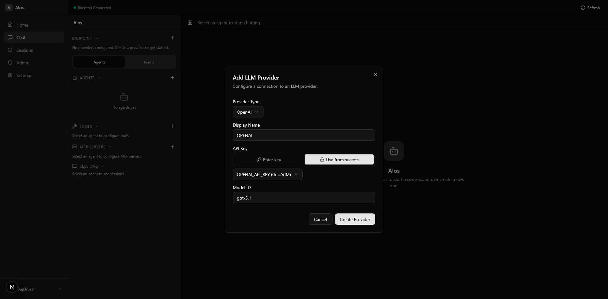
*Configure LLM providers with encrypted API key storage — enter directly or reference from secrets vault*

</div>

---

### Agent Builder

Create AI agents with custom system prompts, model selection, tool attachments, and MCP server connections. Each agent is fully configurable and can be used standalone or as part of a team.

- **Custom system prompts** — Define agent behavior and personality
- **Per-agent model selection** — Pick the right model for each agent's task
- **Tool attachment** — Equip agents with HTTP, Python, or built-in tools
- **MCP server binding** — Connect agents to external services via MCP
- **Knowledge base** — Attach files for RAG-powered context

<div align="center">

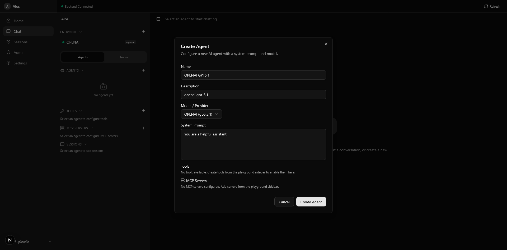
*Agent creation dialog — configure name, model, system prompt, tools, and MCP servers*

</div>

---

### Multi-Agent Teams

Combine multiple agents into coordinated teams for complex tasks. Choose from three collaboration modes that determine how agents interact.

| Mode | Description | Best For |
|------|-------------|----------|
| **Coordinate** | A lead agent delegates tasks to team members | Task decomposition, project management |
| **Route** | Messages are routed to the most appropriate agent | Customer support, multi-domain Q&A |
| **Collaborate** | Agents build on each other's responses sequentially | Research, content creation, review chains |

<div align="center">

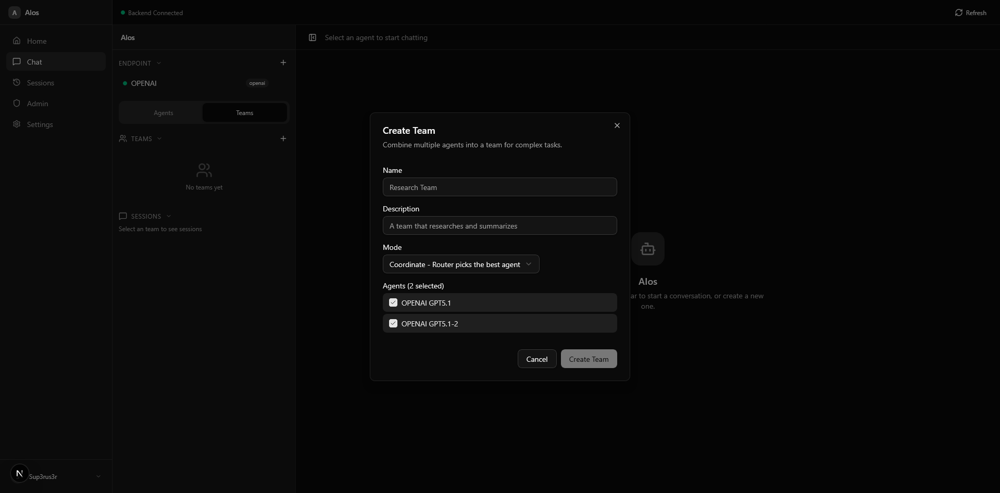
*Team creation — select agents, choose coordination mode, and define team behavior*

</div>

---

### Workflow Automation

Define multi-step sequential workflows where each step is handled by a specific agent. Monitor execution in real-time with per-step status tracking.

- **Sequential pipeline** — Chain agents in order, each step receiving the previous step's output
- **Per-step agent assignment** — Use different agents (and models) for each step
- **Real-time execution** — Watch workflow progress with live streaming per step
- **Run history** — Track past executions with status (pending, running, completed, failed)
- **Reusable definitions** — Save workflow templates and run them repeatedly

<div align="center">

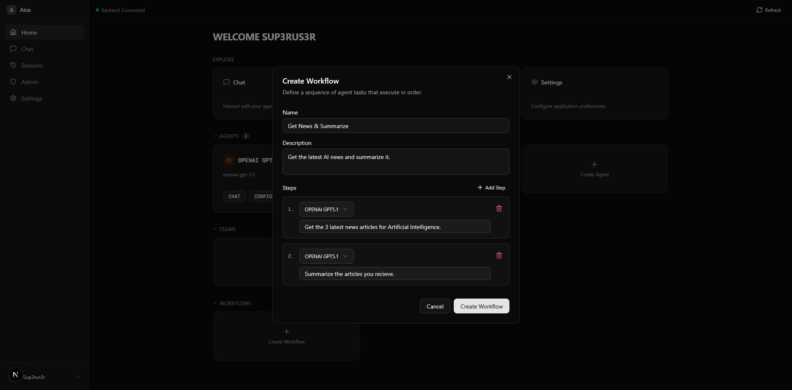
*Workflow builder — define sequential steps with agent assignments and instructions*

</div>

<div align="center">

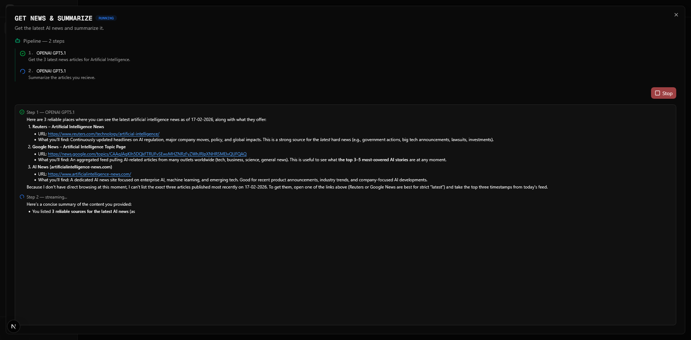
*Live workflow execution — real-time streaming output per step with status indicators*

</div>

---

### Real-Time Chat Playground

A full-featured chat interface for interacting with agents, teams, and workflows. Powered by Server-Sent Events (SSE) for real-time streaming.

- **Live streaming responses** — Token-by-token output via SSE
- **Tool execution visualization** — See tool calls, parameters, and results inline
- **Chain-of-thought reasoning** — View agent thinking steps for supported models
- **File attachments** — Send images, PDFs, Word docs, markdown, and text files
- **Prompt suggestions** — Quick-start prompts to get conversations going
- **Markdown rendering** — GitHub-flavored markdown with syntax highlighting (Shiki), math (KaTeX), and Mermaid diagrams
- **Artifact rendering** — Rich display of agent-generated structured outputs
- **Agentic tool loops** — Agents can execute up to 10 rounds of tool calls per response

<div align="center">

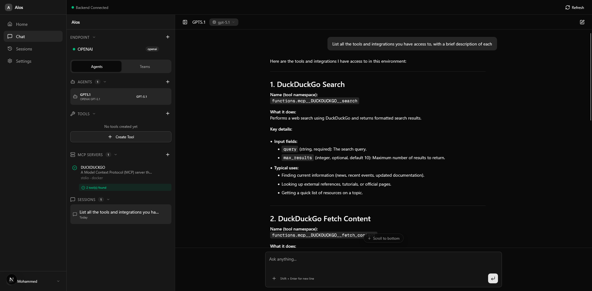
*Chat playground — real-time streaming with MCP tool integration, sidebar with agents, tools, and sessions*

</div>

---

### Tool Integration

Equip agents with tools using pre-built templates or custom definitions. Tools are defined with JSON Schema parameters and can call external APIs, run Python code, or use built-in functions.

| Template | Description |
|----------|-------------|
| **Weather Lookup** | Get current weather for any location |
| **Calculator** | Evaluate mathematical expressions |
| **Web Search** | Search the web for information |
| **Date & Time** | Get the current date and time |
| **API Request** | Call any external REST API endpoint |
| **Custom Python** | Write your own Python handler function |
| **Blank Tool** | Define a tool from scratch with full JSON Schema |

<div align="center">

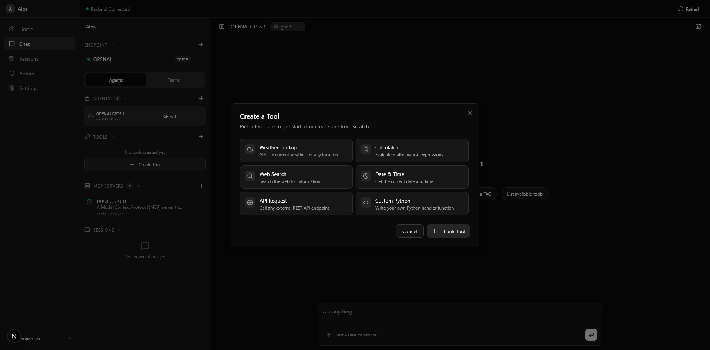
*Tool creation — choose from pre-built templates or create custom tools from scratch*

</div>

---

### MCP Protocol Support

Connect external services via the [Model Context Protocol](https://modelcontextprotocol.io/). MCP servers expose tools that agents can discover and use during conversations.

- **Stdio transport** — Run local MCP servers as child processes (Docker, npx, Python, etc.)
- **SSE transport** — Connect to remote MCP servers over HTTP
- **Connection testing** — Verify server connectivity and discover available tools before saving
- **Environment variables** — Pass API keys and configuration to MCP servers securely
- **Per-agent binding** — Attach specific MCP servers to specific agents

<div align="center">

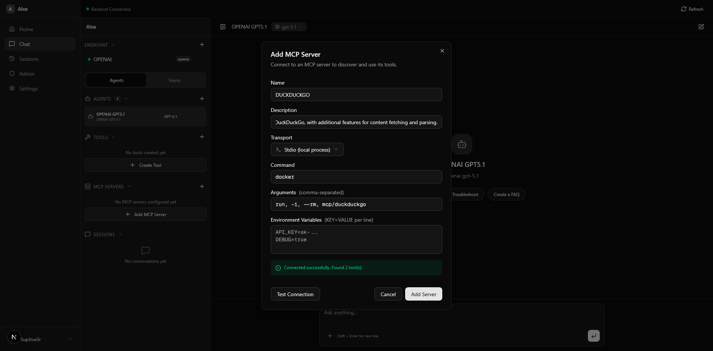
*MCP server setup — stdio transport with Docker, connection testing, and tool discovery*

</div>

---

### Secrets Vault

Store API keys, tokens, and sensitive credentials in an encrypted vault. Secrets are encrypted at rest with Fernet encryption and can be referenced when configuring providers — no need to paste raw API keys.

- **Fernet encryption at rest** — All secret values are encrypted before storage
- **AES encryption in transit** — Secrets are transmitted via encrypted payloads
- **Reference in providers** — Use stored secrets when adding LLM providers instead of entering keys directly
- **CRUD management** — Create, view, update, and delete secrets from the settings page

<div align="center">

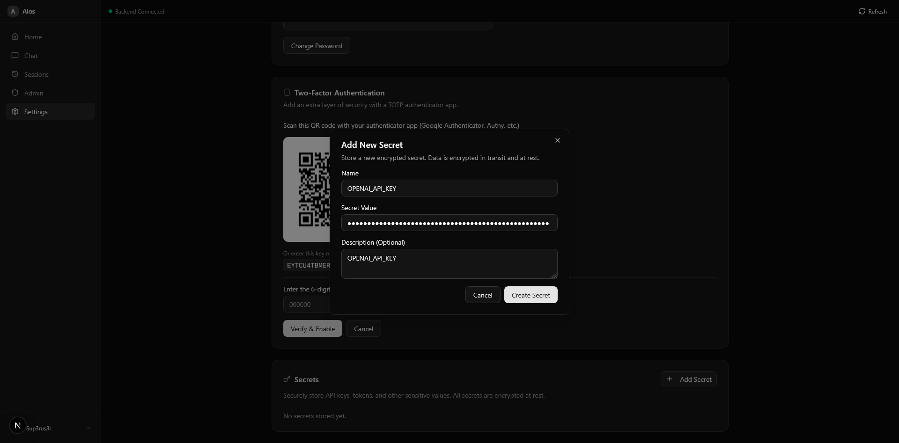
*Secrets management — encrypted storage for API keys with provider integration*

</div>

---

### Session History

Browse, search, and manage past conversations. Sessions are organized by agent or team and can be filtered by type.

- **Search** — Find conversations by content
- **Filter by type** — View agent, team, or workflow sessions
- **Resume conversations** — Click a session to continue where you left off
- **Delete sessions** — Remove conversations you no longer need

<div align="center">

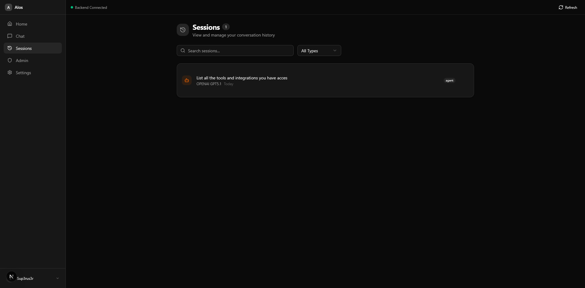
*Session history — search and filter past conversations by type*

</div>

---

### Security & Authentication

Enterprise-grade security features built in from day one.

| Feature | Implementation |
|---------|---------------|
| **JWT Authentication** | HS256 signed tokens with configurable expiry |
| **Two-Factor Auth (2FA)** | TOTP-based with QR code enrollment (Google Authenticator, Authy) |
| **End-to-End Encryption** | AES-encrypted request payloads (CryptoJS client, PyCryptodome server) |
| **Secrets at Rest** | Fernet-encrypted storage for API keys and credentials |
| **Password Hashing** | Bcrypt with salt for all user passwords |
| **Rate Limiting** | Per-endpoint limits via SlowAPI (configurable per user and API client) |
| **API Client Credentials** | Generate client ID/secret pairs for programmatic access |

<div align="center">

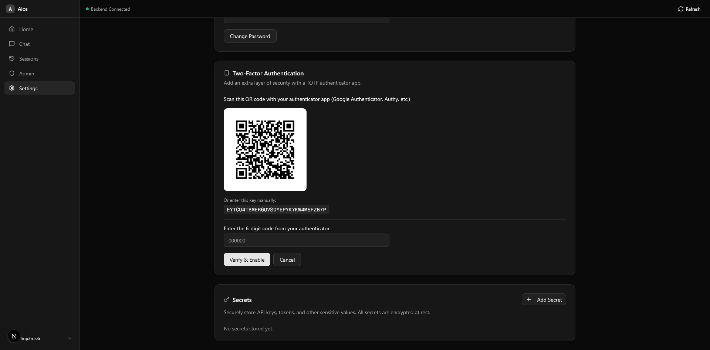
*TOTP two-factor authentication — scan QR code with any authenticator app*

</div>

---

### Admin Panel & RBAC

Manage users, assign roles, and control permissions with a granular role-based access control system.

- **Admin & Guest roles** — Two built-in roles with configurable permissions
- **Six permission flags** — Create Agents, Create Teams, Create Workflows, Create Tools, Manage Providers, Manage MCP Servers
- **User management** — Create, edit, and delete user accounts
- **Statistics dashboard** — View total users, admin count, and guest count

<div align="center">

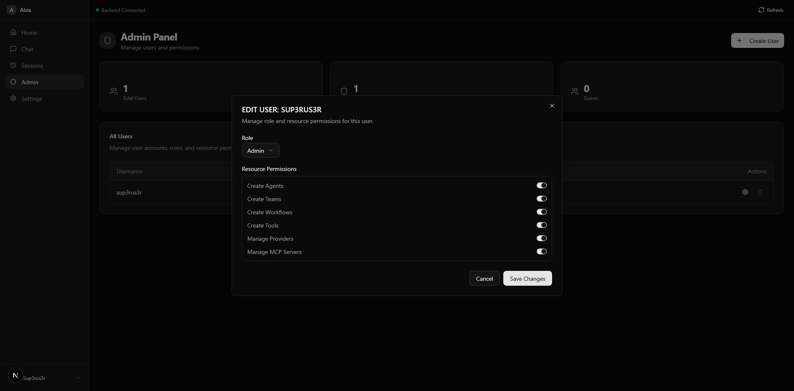
*Admin panel — manage users, roles, and granular resource permissions*

</div>

---

### RAG & File Attachments

Upload documents and images directly into chat conversations. Files are automatically processed for retrieval-augmented generation.

- **Supported formats** — PNG, JPG, GIF, WebP, PDF, Word (.docx), Markdown, plain text
- **Automatic chunking** — Documents are split and indexed for vector search
- **Per-session indexes** — Each conversation gets its own vector store
- **FAISS / Leann HNSW** — FAISS on Windows, Leann HNSW on Linux/macOS for vector similarity search

---

### Dual Database Support

Run with zero-config SQLite out of the box, or switch to MongoDB for production deployments. Every endpoint supports both databases with automatic branching.

| Database | Config | Use Case |
|----------|--------|----------|
| **SQLite** | Default — no setup required | Development, single-user, small teams |
| **MongoDB** | Set `DATABASE_TYPE=mongo` | Production, multi-user, horizontal scaling |

---

## Screenshots

| Feature | Screenshot |
|---------|------------|
| Dashboard |  |
| Chat Playground |  |
| Agent Creation |  |
| Team Creation |  |
| Workflow Builder |  |
| Workflow Execution |  |
| LLM Providers |  |
| Tool Templates |  |
| MCP Servers |  |
| Secrets Vault |  |
| Session History |  |
| Two-Factor Auth |  |
| Admin Panel |  |

---

## Architecture

```
┌──────────────────────────────┐       ┌──────────────────────────────┐
│         Frontend             │       │          Backend             │
│    Next.js 16 + React 19     │──────>│     FastAPI + SQLAlchemy     │
│    Port 3000                 │ /api  │     Port 8000                │
│                              │proxy  │                              │
│  ┌────────┐ ┌─────────────┐ │       │  ┌──────────┐ ┌───────────┐ │
│  │NextAuth│ │ Zustand      │ │       │  │ JWT Auth │ │ LLM       │ │
│  │  v5    │ │ State Mgmt   │ │       │  │ + 2FA    │ │ Providers │ │
│  └────────┘ └─────────────┘ │       │  └──────────┘ └───────────┘ │
│  ┌────────┐ ┌─────────────┐ │       │  ┌──────────┐ ┌───────────┐ │
│  │Radix UI│ │ CryptoJS    │ │       │  │ MCP      │ │ RAG       │ │
│  │/shadcn │ │ Encryption  │ │       │  │ Client   │ │ Service   │ │
│  └────────┘ └─────────────┘ │       │  └──────────┘ └───────────┘ │
└──────────────────────────────┘       └──────────┬───────────────────┘
                                                  │
                                       ┌──────────▼───────────────────┐
                                       │   SQLite (default) / MongoDB │
                                       └──────────────────────────────┘
```

**How it works:**

1. The Next.js frontend proxies all `/api/*` requests to the FastAPI backend via `next.config.ts` rewrites
2. Authentication flows through NextAuth v5 on the frontend and JWT verification on the backend
3. All auth-sensitive payloads are AES-encrypted end-to-end (CryptoJS client-side, PyCryptodome server-side)
4. Chat responses stream via Server-Sent Events (SSE) for real-time token delivery
5. LLM providers are abstracted behind a factory pattern — agents reference a provider, not a specific SDK

---

## Quick Start

### Prerequisites

| Tool | Version | Purpose |
|------|---------|---------|
| [Python](https://www.python.org/) | 3.12+ | Backend runtime |
| [Node.js](https://nodejs.org/) | 18+ | Frontend runtime |
| [uv](https://docs.astral.sh/uv/) | Latest | Python package manager |
| [npm](https://www.npmjs.com/) | 9+ | Node package manager |

### Backend Setup

```bash
# Navigate to the backend directory
cd control_plane/backend

# Install Python dependencies
uv sync

# Configure environment variables (see Environment Variables section)
# Edit .env with your keys

# Start the FastAPI development server
uv run uvicorn main:app --reload
```

The backend API will be available at `http://localhost:8000`. Interactive docs at `http://localhost:8000/docs`.

### Frontend Setup

```bash
# Navigate to the frontend directory
cd control_plane/frontend

# Install Node.js dependencies
npm install

# Configure environment variables
# Edit .env.local with your keys

# Start the Next.js development server
npm run dev
```

The frontend will be available at `http://localhost:3000`.

### Running Both Together

```bash
# From the control_plane root directory
cd control_plane

# Starts both frontend and backend concurrently
npm run dev
```

### Environment Variables

#### Backend (`backend/.env`)

> **Important:** You must generate real secret keys before starting the backend. Placeholder values will cause startup errors.

```bash
# Generate ENCRYPTION_KEY and JWT_SECRET_KEY (any random string works):
openssl rand -hex 32

# Generate PROVIDER_KEY_SECRET (must be a valid Fernet key — 32 url-safe base64-encoded bytes):
python -c "from cryptography.fernet import Fernet; print(Fernet.generate_key().decode())"
```

```env
# Encryption key for AES payload encryption (must match frontend NEXT_PUBLIC_ENCRYPTION_KEY)
ENCRYPTION_KEY=<output of: openssl rand -hex 32>

# JWT authentication
JWT_SECRET_KEY=<output of: openssl rand -hex 32>
JWT_ALGORITHM=HS256
JWT_ACCESS_TOKEN_EXPIRE_MINUTES=30

# Fernet key for encrypting provider API keys at rest (MUST be a valid Fernet key)
PROVIDER_KEY_SECRET=<output of: python -c "from cryptography.fernet import Fernet; print(Fernet.generate_key().decode())">

# Rate limiting (requests per minute)
RATE_LIMIT_USER=60
RATE_LIMIT_API_CLIENT=100

# Database type: "sqlite" (default) or "mongo"
DATABASE_TYPE=sqlite
```

#### Frontend (`frontend/.env.local`)

```env
# NextAuth.js signing secret
AUTH_SECRET=your-auth-secret

# Application URL
AUTH_URL=http://localhost:3000

# Public encryption key (must match backend ENCRYPTION_KEY)
NEXT_PUBLIC_ENCRYPTION_KEY=your-encryption-key
```

---

## Usage Guide

### 1. Add an LLM Provider

Navigate to the **Chat** page sidebar and click **+** next to Endpoints. Select a provider type (OpenAI, Anthropic, Google, Ollama, etc.), enter your API key or reference one from the secrets vault, and specify the model ID.

### 2. Create an Agent

Click **+** next to Agents in the sidebar. Configure the agent with a name, system prompt, and model/provider selection. Optionally attach tools and MCP servers.

### 3. Start Chatting

Select your agent from the sidebar and start a conversation. Responses stream in real-time. Attach files, view tool executions, and explore chain-of-thought reasoning.

### 4. Build a Team

Switch to the **Teams** tab, click **+**, and combine multiple agents. Choose a coordination mode (Coordinate, Route, or Collaborate) and start a team chat.

### 5. Create a Workflow

From the **Dashboard**, click **Create Workflow**. Add sequential steps, each assigned to a specific agent with custom instructions. Run the workflow and watch each step execute in real-time.

### 6. Configure MCP Servers

In the sidebar, click **+** next to MCP Servers. Set up servers using stdio (local Docker/npx/python) or SSE (remote HTTP) transport. Test the connection to discover available tools, then bind servers to agents.

### 7. Manage Secrets

Go to **Settings > Secrets** to store API keys and tokens in the encrypted vault. Reference stored secrets when adding LLM providers.

### 8. Enable Two-Factor Authentication

In **Settings**, enable 2FA by scanning the QR code with an authenticator app (Google Authenticator, Authy, etc.). Enter the 6-digit code to verify setup.

### 9. Manage Users (Admin)

Navigate to the **Admin** panel to create users, assign roles (Admin/Guest), and configure granular resource permissions.

---

## API Reference

The backend exposes a RESTful API with interactive documentation:

- **Swagger UI** — `http://localhost:8000/docs`
- **ReDoc** — `http://localhost:8000/redoc`

### Key Endpoints

| Category | Endpoint | Method | Description |
|----------|----------|--------|-------------|
| **Auth** | `/auth/register` | POST | Create a new user account |
| **Auth** | `/auth/login` | POST | Authenticate and receive JWT token |
| **Agents** | `/agents` | GET | List all agents |
| **Agents** | `/agents` | POST | Create a new agent |
| **Agents** | `/agents/{id}` | PUT | Update an agent |
| **Agents** | `/agents/{id}` | DELETE | Delete an agent |
| **Teams** | `/teams` | GET | List all teams |
| **Teams** | `/teams` | POST | Create a new team |
| **Workflows** | `/workflows` | GET | List all workflows |
| **Workflows** | `/workflows` | POST | Create a new workflow |
| **Workflows** | `/workflows/{id}/run` | POST | Execute a workflow (SSE) |
| **Workflows** | `/workflows/{id}/runs` | GET | List workflow run history |
| **Chat** | `/chat` | POST | Stream a chat response (SSE) |
| **Sessions** | `/sessions` | GET | List conversation sessions |
| **Sessions** | `/sessions/{id}/messages` | GET | Get session messages |
| **Providers** | `/providers` | GET | List configured LLM providers |
| **Providers** | `/providers/{id}/test` | POST | Test provider connection |
| **Providers** | `/providers/{id}/models` | GET | List available models |
| **Tools** | `/tools` | GET | List available tool definitions |
| **Tools** | `/tools` | POST | Create a tool definition |
| **MCP** | `/mcp-servers` | GET | List MCP server configurations |
| **MCP** | `/mcp-servers/{id}/test` | POST | Test MCP server connection |
| **Secrets** | `/secrets` | GET | List user secrets (encrypted) |
| **Secrets** | `/secrets` | POST | Create a new secret |
| **Files** | `/files/upload` | POST | Upload a file attachment |
| **Dashboard** | `/dashboard/stats` | GET | Get dashboard statistics |
| **Admin** | `/admin/users` | GET | List all users (admin only) |
| **Admin** | `/admin/users` | POST | Create a user (admin only) |
| **Admin** | `/admin/users/{id}` | PUT | Update user role/permissions |
| **User** | `/user/2fa/setup` | POST | Set up TOTP two-factor auth |
| **User** | `/user/2fa/verify` | POST | Verify 2FA setup |
| **User** | `/user/api-clients` | POST | Generate API client credentials |
| **Health** | `/health` | GET | Health check |

### Programmatic Access

Generate API client credentials from **Settings** to access the API programmatically:

```bash
curl -H "X-API-Key: your-client-id" \
     -H "X-API-Secret: your-client-secret" \
     http://localhost:8000/agents
```

---

## Tech Stack

### Frontend

| Technology | Purpose |
|------------|---------|
| [Next.js 16](https://nextjs.org/) | React framework with App Router |
| [React 19](https://react.dev/) | UI component library |
| [NextAuth v5](https://authjs.dev/) | Authentication & session management |
| [Tailwind CSS 4](https://tailwindcss.com/) | Utility-first styling |
| [Radix UI](https://www.radix-ui.com/) / [shadcn/ui](https://ui.shadcn.com/) | Accessible component primitives |
| [Zustand](https://zustand.docs.pmnd.rs/) | Lightweight state management |
| [CryptoJS](https://github.com/brix/crypto-js) | Client-side AES encryption |
| [Lucide React](https://lucide.dev/) | Icon library |
| [Motion](https://motion.dev/) | Animation library |
| [Shiki](https://shiki.style/) | Syntax highlighting |
| [Sonner](https://sonner.emilkowal.dev/) | Toast notifications |

### Backend

| Technology | Purpose |
|------------|---------|
| [FastAPI](https://fastapi.tiangolo.com/) | Async Python web framework |
| [SQLAlchemy](https://www.sqlalchemy.org/) | SQL ORM (SQLite) |
| [Motor](https://motor.readthedocs.io/) | Async MongoDB driver |
| [Pydantic](https://docs.pydantic.dev/) | Data validation & serialization |
| [python-jose](https://github.com/mpdavis/python-jose) | JWT token handling |
| [bcrypt](https://github.com/pyca/bcrypt) | Password hashing |
| [PyCryptodome](https://www.pycryptodome.org/) | AES encryption |
| [PyOTP](https://github.com/pyauth/pyotp) | TOTP two-factor authentication |
| [SSE-Starlette](https://github.com/sysid/sse-starlette) | Server-Sent Events streaming |
| [MCP SDK](https://modelcontextprotocol.io/) | Model Context Protocol client |
| [FAISS](https://github.com/facebookresearch/faiss) | Vector similarity search |
| [SlowAPI](https://github.com/laurentS/slowapi) | Rate limiting |
| [uv](https://docs.astral.sh/uv/) | Fast Python package manager |

---

## Project Structure

```
control_plane/
├── package.json                    # Root — runs frontend + backend concurrently
│
├── backend/                        # FastAPI Python backend
│   ├── main.py                     # App entrypoint, middleware, lifespan
│   ├── pyproject.toml              # Python dependencies (uv)
│   ├── .env                        # Backend environment config
│   │
│   ├── auth.py                     # JWT token generation & verification
│   ├── config.py                   # Database type configuration
│   ├── crypto_utils.py             # AES payload encryption/decryption
│   ├── encryption.py               # Fernet encryption for secrets at rest
│   ├── database.py                 # SQLAlchemy engine & session (SQLite)
│   ├── database_mongo.py           # Motor async MongoDB driver setup
│   ├── models.py                   # SQLAlchemy ORM models
│   ├── models_mongo.py             # MongoDB collection models
│   ├── schemas.py                  # Pydantic request/response schemas
│   ├── rate_limiter.py             # Rate limiting middleware
│   ├── mcp_client.py               # MCP server connection & tool bridging
│   ├── rag_service.py              # Vector search & RAG pipeline
│   ├── file_storage.py             # File upload/download handling
│   │
│   ├── llm/                        # LLM provider integrations
│   │   ├── base.py                 # Base provider interface
│   │   ├── provider_factory.py     # Factory pattern for provider selection
│   │   ├── anthropic_provider.py   # Anthropic (Claude) provider
│   │   ├── openai_provider.py      # OpenAI / OpenRouter provider
│   │   ├── google_provider.py      # Google Gemini provider
│   │   └── ollama_provider.py      # Local Ollama provider
│   │
│   └── routers/                    # API route handlers
│       ├── auth_router.py          # Login, register, 2FA/TOTP
│       ├── user_router.py          # User profiles, API clients, 2FA
│       ├── agents_router.py        # Agent CRUD
│       ├── teams_router.py         # Team coordination
│       ├── workflows_router.py     # Workflow definitions
│       ├── workflow_runs_router.py  # Workflow execution & tracking
│       ├── chat_router.py          # Real-time streaming chat
│       ├── sessions_router.py      # Conversation sessions
│       ├── providers_router.py     # LLM provider configuration
│       ├── tools_router.py         # Tool definitions
│       ├── mcp_servers_router.py   # MCP server configuration
│       ├── secrets_router.py       # Encrypted user secrets
│       ├── files_router.py         # File attachments
│       ├── dashboard_router.py     # Dashboard statistics
│       └── admin_router.py         # System administration
│
└── frontend/                       # Next.js 16 React frontend
    ├── package.json                # Frontend dependencies
    ├── next.config.ts              # Next.js config (API rewrites)
    ├── auth.ts                     # NextAuth.js v5 configuration
    ├── tsconfig.json               # TypeScript configuration
    ├── .env.local                  # Frontend environment config
    │
    ├── app/                        # Next.js app directory
    │   ├── layout.tsx              # Root layout (toasts, providers)
    │   ├── page.tsx                # Landing page
    │   ├── providers.tsx           # Auth session provider wrapper
    │   ├── login/page.tsx          # Login page with 2FA support
    │   ├── register/page.tsx       # User registration
    │   │
    │   ├── (authenticated)/        # Protected routes
    │   │   ├── layout.tsx          # Sidebar & navigation
    │   │   ├── home/page.tsx       # Dashboard
    │   │   ├── playground/page.tsx # Chat interface
    │   │   ├── sessions/page.tsx   # Conversation history
    │   │   ├── settings/page.tsx   # User settings, 2FA, secrets
    │   │   ├── admin/page.tsx      # Admin panel
    │   │   └── guest/page.tsx      # Guest access mode
    │   │
    │   └── api/routes.ts           # Central API route definitions
    │
    ├── components/                 # React components
    │   ├── landing/                # Landing page sections (hero, features, etc.)
    │   ├── playground/             # Chat, sidebar, agent & team dialogs
    │   ├── dialogs/                # Modal dialogs (tools, workflows, MCP, admin)
    │   ├── ai-elements/            # Chat & streaming display components
    │   └── ui/                     # shadcn / Radix UI primitives
    │
    ├── lib/                        # Utility libraries
    │   ├── api-client.ts           # HTTP client with auth headers
    │   ├── crypto.ts               # Client-side AES encryption
    │   ├── crypto-server.ts        # Server action encryption
    │   ├── stream.ts               # SSE streaming response handler
    │   └── utils.ts                # General utilities
    │
    ├── stores/                     # Zustand state management
    │   ├── playground-store.ts     # Agents, teams, workflows state
    │   ├── dashboard-store.ts      # Dashboard state
    │   ├── permissions-store.ts    # User permissions state
    │   └── admin-store.ts          # Admin panel state
    │
    ├── hooks/                      # Custom React hooks
    │   └── use-confirm.tsx         # Confirmation dialog hook
    │
    ├── types/                      # TypeScript type definitions
    │   ├── playground.ts           # Agent, Team, Workflow types
    │   └── api.ts                  # API response types
    │
    └── config/                     # Frontend configuration
        └── routes.ts               # Client-side route constants
```

---

## Contributing

Contributions are welcome! Whether it's bug reports, feature requests, or code contributions — all input is valued.

### How to Contribute

1. **Fork the repository**

   Click the [Fork](https://github.com/sup3rus3r/aios/fork) button at the top right of this page.

2. **Clone your fork**

   ```bash
   git clone https://github.com/your-username/aios.git
   cd aios
   ```

3. **Create a feature branch**

   ```bash
   git checkout -b feature/your-feature-name
   ```

4. **Make your changes**

   - Follow the existing code style and patterns
   - Write clear, descriptive commit messages
   - Add or update tests where applicable

5. **Test your changes**

   ```bash
   # Backend
   cd control_plane/backend
   uv run uvicorn main:app --reload

   # Frontend
   cd control_plane/frontend
   npm run dev
   ```

6. **Commit and push**

   ```bash
   git add .
   git commit -m "feat: description of your changes"
   git push origin feature/your-feature-name
   ```

7. **Open a Pull Request**

   Go to your fork on GitHub and click **New Pull Request**. Provide a clear description of what your changes do and why.

### Contribution Guidelines

- **Bug Reports** — Use [GitHub Issues](https://github.com/sup3rus3r/aios/issues) with the `bug` label. Include steps to reproduce, expected behavior, and screenshots if applicable.
- **Feature Requests** — Open an issue with the `enhancement` label describing the feature and its use case.
- **Code Style** — Match existing patterns. Frontend uses TypeScript with functional components; backend uses Python type hints and Pydantic schemas.
- **Commits** — Use [Conventional Commits](https://www.conventionalcommits.org/) format (`feat:`, `fix:`, `docs:`, `refactor:`, etc.).
- **Pull Requests** — Keep PRs focused on a single change. Link related issues in the PR description.

### Development Setup

See the [Quick Start](#quick-start) section for full setup instructions.

---

## Citation

If you use AIos in your research or project, please cite it:

```bibtex
@software{aios,
  title   = {AIos},
  author  = {Sup3rUs3r},
  url     = {https://github.com/sup3rus3r/aios},
  year    = {2025}
}
```

---

## License

This project is licensed under the **MIT License** — see the [LICENSE](LICENSE) file for details.

---

<div align="center">

**[Star this repo](https://github.com/sup3rus3r/aios)** if you find it useful &#11088;

Made with dedication by [SUP3RUS3R](https://github.com/sup3rus3r)

</div>
